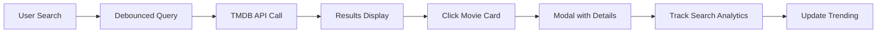

# 🎬 CineScope - Netflix-Style Movie Discovery Platform

A modern, Netflix-inspired movie discovery application built with React, featuring glassmorphism design, real-time search, and trending analytics powered by TMDB API and Appwrite.


## Quick Start

### Prerequisites
```bash
Node.js 18+
npm or yarn
TMDB API Key
Appwrite Account
```

### Installation

1. **Clone the repository**
```bash
git clone https://github.com/yourusername/cinescope-movie-app.git
cd cinescope-movie-app
```

2. **Install dependencies**
```bash
npm install
```

3. **Environment Setup**
```bash
# Create .env file
cp .env.example .env

# Add your API credentials
VITE_TMDB_API_KEY=your_tmdb_api_key_here
VITE_APPWRITE_PROJECT_ID=your_appwrite_project_id
VITE_APPWRITE_DATABASE_ID=your_database_id
VITE_APPWRITE_COLLECTION_ID=your_collection_id
```

4. **Start development server**
```bash
npm run dev
```

5. **Open your browser**
```
http://localhost:5173
```

## Technology Stack

### **Frontend**
- **React 19**
- **Pure CSS**
- **React-Use**

### **Backend Services**
- **TMDB API**
- **Appwrite**
- **Trending System**

## Key Features

### **Core Functionality**
- **Real-Time Search** - Debounced search with instant results
- **Movie Discovery** - Browse popular movies with detailed information
- **Trending Analytics** - Track most searched movies
- **Click-to-Expand** - Modal-based movie details

## UI Highlights

- **Glassmorphism Cards** with Netflix red accents
- **Bebas Neue Typography** for that cinematic feel
- **Color-Coded Ratings** (Green → Yellow → Orange → Red)
- **Animated Background** with floating particles
- **Professional Modal System** with blur overlays

### **User Experience**


## How It Works

### 1. **Movie Search Pipeline**
- **Debounced Input**: 500ms delay prevents excessive API calls
- **Smart Filtering**: Removes movies without posters for better UX
- **Error Handling**: Graceful fallbacks and user-friendly messages

### 2. **Trending System**
- **Search Tracking**: Every search is logged to Appwrite
- **Count Analytics**: Popular searches bubble to the top
- **Real-Time Updates**: Trending section updates based on user behavior

### 3. **Netflix-Style Interface**
- **Card-Based Layout**: Clean, scannable movie grid
- **Hover Effects**: Subtle animations and visual feedback
- **Modal System**: Detailed movie information without page navigation

## Performance Features

- **Image Optimization**: Lazy loading and error handling
- **API Efficiency**: Smart caching and debounced requests  
- **Smooth Animations**: Hardware-accelerated CSS transitions
- **Mobile Optimized**: Touch-friendly interface design
